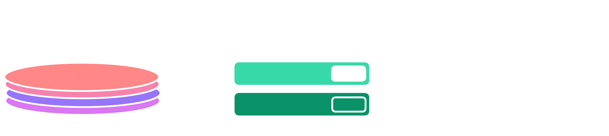

## Serveur Web

Le serveur étant une pièce importante, voici un petit point sur comment on le met au point dans notre projet.

On utilisera Elysia (un framework utilisant Bun) pour répondre aux requêtes que reçoit le serveur. 

D'une part à `/` il renverra tous les fichiers statiques (index.html, style.css, ....)

D'une autre part à `/api` il communiquera avec la base de données et renverra des données. 